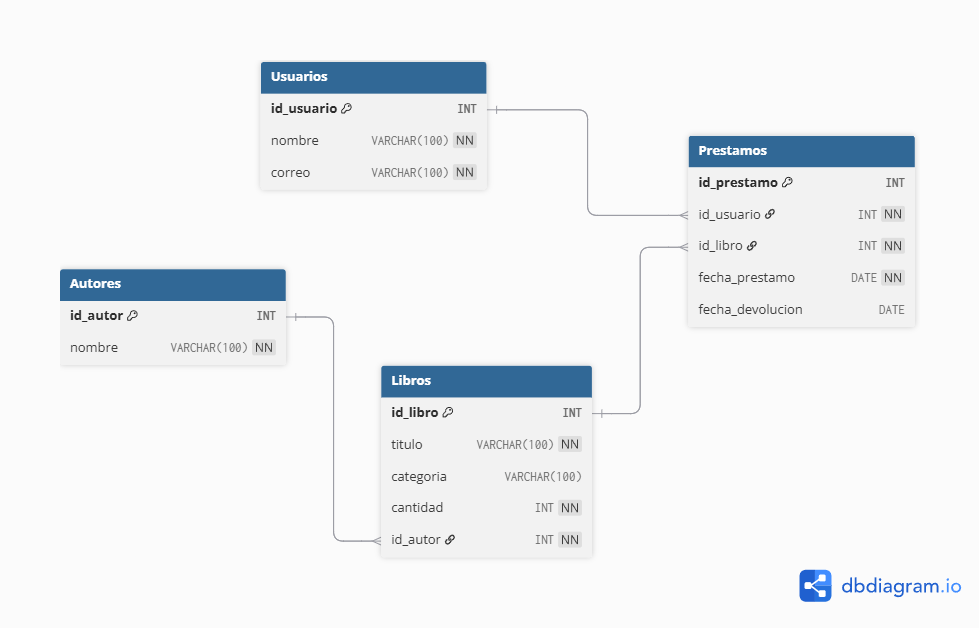
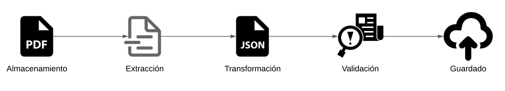

# Prueba Tecnica

**Nombre:** David Camilo Cortes Salazar

**Pregrado:** Ciencias de la Computación

**Institución:** Universidad Nacional de Colombia

## **Parte 1: Análisis de Problema**

### **Contexto:**

Supongamos que tienes la tarea de desarrollar un sistema para gestionar una biblioteca.
La biblioteca tiene libros, autores y usuarios. Cada libro tiene un título, un autor asociado,
una categoría y una cantidad disponible. Un autor tiene un nombre y una lista de libros
escritos. Un usuario tiene un nombre, un correo electrónico y una lista de libros
prestados.

### **Modelado de Datos:**

Diseña un modelo de base de datos relacional que represente la estructura de la
biblioteca. Incluye las tablas necesarias, así como las relaciones entre ellas.

#### Modelo Propuesto:

Para fines de practicidad en esta prueba tecnica, supondre el uso de una base de datos MySQL. Siendo asi El diagrama de entidad-relacion propuesto es el siguiente:



<div style="page-break-after: always;"></div>

### **Consulta SQL:**

Escribe una consulta SQL que devuelva todos los libros de un autor específico, incluyendo
el título del libro y la categoría.

#### **Consulta propuesta:**

```SQL
SELECT l.titulo, l.categoria
FROM Libros l
INNER JOIN Autores a ON l.id_autor = a.id_autor
WHERE a.nombre = 'AUTOR';
```

donde AUTOR es el nombre del autor.

### **Optimización de Consulta:**

Supongamos que la base de datos de la biblioteca está creciendo rápidamente, y la
consulta anterior se está volviendo lenta. Proporciona al menos dos estrategias para
optimizar la consulta y mejorar su rendimiento.

#### Optimización propuesta:

Una forma que se me ocurre a primera vista es omitir el inner join al consultar el id del autor y con este id hacer la consulta de sus libros.

```SQL
SELECT l.titulo, l.categoria
FROM Libros l
WHERE l.id_autor = (
    SELECT id_autor FROM Autores WHERE nombre = 'AUTOR'
);
```

donde AUTOR es el nombre del autor.

Esto es mas eficiente ya que antes se comparaba el nombre del autor con el autor de cada libro, pero ahora se busca el autor en especifico y luego obtenemos sus libros.

Dejo este enlace: [Prueba de modelo](https://runsql.com/r/a30626e999f8139b), para hacer las validaciónes correspondientes al modelo y consultas propuestas.

<div style="page-break-after: always;"></div>

## **Parte 2: Creación de API REST**

### **Contexto:**

Ahora, debes crear una API REST para permitir la gestión de libros en la biblioteca. La API
debe proporcionar endpoints para listar, agregar, actualizar y eliminar libros.

### **Diseño de la API:**

Esquematiza la estructura de la API REST que planeas desarrollar. Define los endpoints
necesarios, los métodos HTTP permitidos y los formatos de datos esperados y devueltos.

#### Diseño propuesto:

Adicional a los endpoints solicitados, añadire tres que seran de utilidad en el futuro de la solución a esta prueba.

**Buscar libro por id**:

  - Retorna la información de un libro segun su id.

  - Endpoint: <code>/libros/{id}</code>
  
  - Metodo: <code>GET</code>
  
  - Parametros: *id* -> id del libro a buscar

  - Formato de Request: 

    ```
    /libros/1
    ```

  - Formato de Response:

    - Respuesta: <code>200 OK</code>

        ```json
        {
            "id_libro": 1,
            "titulo": "Trilogía de la Fundación",
            "categoria": "Novela",
            "cantidad": 5,
            "autor": "Isaac Asimov"
        }
        ```
  
    - Respuesta: <code>404 Not Found</code>

        ```json
        { "error": "Libro no encontrado" }
        ```

<div style="page-break-after: always;"></div>

**Buscar autor por id**:

  - Retorna la información de un autor segun su id.

  - Endpoint: <code>/autores/{id}</code>
  
  - Metodo: <code>GET</code>
  
  - Parametros: *id* -> id del autor a buscar

  - Formato de Request: 

    ```
    /autores/1
    ```

  - Formato de Response:

    - Respuesta: <code>200 OK</code>

        ```json
        {
            "id_autor": 1,
            "autor": "Isaac Asimov"
        }
        ```
  
    - Respuesta: <code>404 Not Found</code>

        ```json
        { "error": "Autor no encontrado" }
        ```

<div style="page-break-after: always;"></div>

**Agregar nuevo autor**:

  - Agrega un nuevo autor a la base de datos.

  - Endpoint: <code>/autores</code>
  
  - Metodo: <code>POST</code>

  - Formato de Request: 

    ```json
    {
    "autor": "Robert Louis Stevenson"
    }
    ```

  - Formato de Response:

    - Respuesta: <code>201 Created</code>

        ```json
        {
            "id_autor": 6,
            "autor": "Robert Louis Stevenson"
        }
        ```

<div style="page-break-after: always;"></div>

**Listar**: 

  - Retorna un conjunto de datos de los libros que se ajusten a los filtros especificados.

  - Endpoint: <code>/libros</code>
  
  - Metodo: <code>GET</code>
  
  - Filtros: *titulo*, *autor*, *categoria*.

  - Formato de Request: 

    ```
    /libros?titulo=xx?autor=xx?categoria=xx
    ```

  - Formato de Response:

    - Respuesta: <code>200 OK</code>

        ```json
        [{
            "id_libro": 1,
            "titulo": "Trilogía de la Fundación",
            "categoria": "Novela",
            "cantidad": 5,
            "id_autor": 1
        },
        {
            "id_libro": 2,
            "titulo": "1984",
            "categoria": "Novela",
            "cantidad": 3,
            "id_autor": 2
        }]
        ```
  
    - Respuesta: <code>404 Not Found</code>

        ```json
        { "error": "Libros no encontrados" }
        ```

<div style="page-break-after: always;"></div>

**Agregar**: 

  - Agrega la información de un libro nuevo a la base de datos.

  - Endpoint: <code>/libros</code>
  
  - Metodo: <code>POST</code>

  - Formato de Request: 

    ```json
    {
    "titulo": "Crimen y Castigo",
    "categoria": "Novela",
    "cantidad": 7,
    "id_autor": 3
    }
    ```

  - Formato de Response:

    - Respuesta: <code>201 Created</code>

        ```json
        {
        "id_libro": 3,
        "titulo": "Crimen y Castigo",
        "categoria": "Novela",
        "cantidad": 7,
        "id_autor": 3
        }
        ```

<div style="page-break-after: always;"></div>

**Actualizar**: 

  - Actualiza la información de un libro en la base de datos.

  - Endpoint: <code>/libros/{id}</code>
  
  - Metodo: <code>PUT</code>

  - Parametros: *id* -> id del libro a modificar.

  - Formato de Request: 

    ```json
    {
    "titulo": "María",
    "categoria": "Novela",
    "cantidad": 1,
    "id_autor": 4
    }
    ```

  - Formato de Response:

    - Respuesta: <code>200 OK</code>

        ```json
        {
        "id_libro": 4,
        "titulo": "María",
        "categoria": "Novela",
        "cantidad": 1,
        "id_autor": 4
        }
        ```

<div style="page-break-after: always;"></div>

**Eliminar**: 

  - Elimina la información de un libro en la base de datos.

  - Endpoint: <code>/libros/{id}</code>
  
  - Metodo: <code>DELETE</code>

  - Parametros: *id* -> id del libro a eliminar.

  - Formato de Request: 

    ```
    /libros/1
    ```

  - Formato de Response:

    - Respuesta: <code>204 No Content</code>

    - Respuesta: <code>404 Not Found</code>

        ```json
        { "error": "Libro no encontrado" }
        ```

<div style="page-break-after: always;"></div>

### **Implementación:**

Utilizando el lenguaje de programación de tu elección, implementa al menos dos endpoints de la API: uno para listar todos los libros y otro para agregar un nuevo libro. 

Asegúrate de manejar los posibles errores y devolver respuestas adecuadas.

#### **Implementación propuesta:**

En el archivo <code>implementacion_api.js</code> se encuentra el codigo correspondiente en Javascript.

El manejo de la API REST se hace mediante **express** y el manejo de la base de datos se hace mediante **mysql2**.

<div style="page-break-after: always;"></div>

### **Documentación**:

Escribe una breve documentación para la API que explique cómo usar cada uno de los endpoints implementados. Incluye ejemplos de solicitudes y respuestas.

#### Documentación propuesta:

- <code>GET</code> **/libros**: Lista todos los libros:
  - Parametros: No aplica
  - Respuestas:
    - <code>200</code>:
      - Ej:
        
            ```json
            [
            {
              "id_libro": 1,
              "titulo": "Trilogía de la Fundación",
              "categoria": "Novela",
              "cantidad": 5,
              "autor": "Isaac Asimov"
            },
            {
              "id_libro": 2,
              "titulo": "1984",
              "categoria": "Novela",
              "cantidad": 3,
              "autor": "George Orwell"
            }
          ]
            ```
    - <code>404</code>:
      - Ej:
        
            ```json
            {
              "error": "Libros no encontrados"
            }
            ```

<div style="page-break-after: always;"></div>


    - <code>500</code>:
      - Ej:
        
            ```json
            {
              "error": "Ocurrio un error en el proceso"
            }
            ```
- <code>POST</code> **/libros**: Agrega un nuevo libro:
  - Parametros:  
      ```json
      {
      "titulo": "La isla del tesoro",
      "categoria": "Aventura",
      "cantidad": 2,
      "autor": "Robert Louis Stevenson"
      }
      ```
  - Respuestas:
    - <code>201</code>:
      - Ej:
        
            ```json
            {
              "id_libro": 10,
              "titulo": "La isla del tesoro",
              "categoria": "Aventura",
              "cantidad": 2,
              "autor": "Robert Louis Stevenson"
            }
            ```
    - <code>400</code>:
      - Ej:
        
            ```json
            {
              "error": "Faltan campos obligatorios"
            }
            ```

<div style="page-break-after: always;"></div>


    - <code>500</code>:
      - Ej:
        
            ```json
            {
              "error": "Ocurrio un error en el proceso"
            }
            ```
- <code>GET</code> **/autores/{id}**: Busca un autor por id:
  - Parametros: **id**: id del autor a buscar
  - Respuestas:
    - <code>200</code>:
      - Ej:
        
            ```json
            [
            {
            "id_autor": 1,
            "autor": "Isaac Asimov"
          }
          ]
            ```
    - <code>404</code>:
      - Ej:
        
            ```json
            {
              "error": "Autor no encontrado"
            }
            ```
    - <code>500</code>:
      - Ej:
        
            ```json
            {
              "error": "Ocurrio un error en el proceso"
            }
            ```

<div style="page-break-after: always;"></div>

- <code>POST</code> **/autores**: Agrega un nuevo autor:
   - Parametros:  
      ```json
      {
        "autor": "Robert Louis Stevenson"
      }
      ```
  - Respuestas:
    - <code>201</code>:
      - Ej:
        
            ```json
            {
              "id_autor": 6,
              "autor": "Robert Louis Stevenson"
            }
            ```
    - <code>400</code>:
      - Ej:
        
            ```json
            {
              "error": "Faltan campos obligatorios"
            }
            ```
    - <code>500</code>:
      - Ej:
        
            ```json
            {
              "error": "Ocurrio un error en el proceso"
            }
            ```


<div style="page-break-after: always;"></div>

## **Parte 3: Automatización de Lectura de PDFs**

### **Contexto**:

Imagina que la biblioteca recibe catálogos en formato PDF con información de libros
nuevos (título, autor, categoría, cantidad disponible). Se requiere un proceso
automatizado que lea estos PDFs y extraiga la información para integrarla en el sistema.

### **Tarea**:

1. Propón una arquitectura o flujo de trabajo para la automatización integrada la API diseñada.

2. Menciona al menos dos librerías o herramientas que usarías para leer PDFs y extraer texto.

#### Solución propuesta:

1. El flujo de trabajo de la automatización vendria dado por los siguientes puntos:

    


    1. **Almacenamiento:** Se debe almacenar estos archivos de catalogos en algun sistema que permita su carga y descarga, para su integración con las demas etapas del proceso.
    
    2. **Extracción:** Se toma el pdf y se extrae la información del mismo de manera organizada. La forma de organizar esta información esta dada por la estructura general que tienen los catalogos admitidos.
    
    3. **Transformación:** Con la información de la organización de los textos, se transforman en un archivo en formato JSON de tal manera que cumpla la estructura requerida para usarse en una petición de nuestra API.
    
    4. **Validación:** Se realizan verificaciónes de tipos de datos y se normalizan los textos. No es necesario verificar que el autor exista en el sistema porque esta validación siempre se hace cuando se llama al endpoint de agregar un libro nuevo.
    
    5. **Guardado:** Se usa el endpoint de agregado de libros de la API para alamacenar su información en la base de datos.

<div style="page-break-after: always;"></div>

2. Para procesamiento de textos, en mi experiencia, python es muy comodo para construir estos flujos de trabajo. 

    Un primer acercamiento podria ser usar **Py2PDF2** pues su comunidad es muy grande y proporciona herramientas para extracciones rapidas. Pero si se quiere algo que sea capaz de realizar analisis mas avanzados sobre componentes de un archivo PDF, las opciones que propondria son:

   - **PDFMiner:** Esta herramienta enfocada en el trabajo con texto en archivos PDF permite una manipulación a detalles de los objetos dentro de este tipo de archivos, permitiendo un mejor entendimiento de la organización de los textos y sus caracteristicas.
  
   - **pdfplumber:** Esta libreria implementa diferentes herramientas de extraccion de información para obtener tanto texto como otros tipos de dato en archivos PDF. Cabe resaltar, que una de sus dependencias es **Pillow** por lo cual se pueden usar tecnicas de OCR en docuementos donde el texto que necesitemos se encuentre en una imagen.

